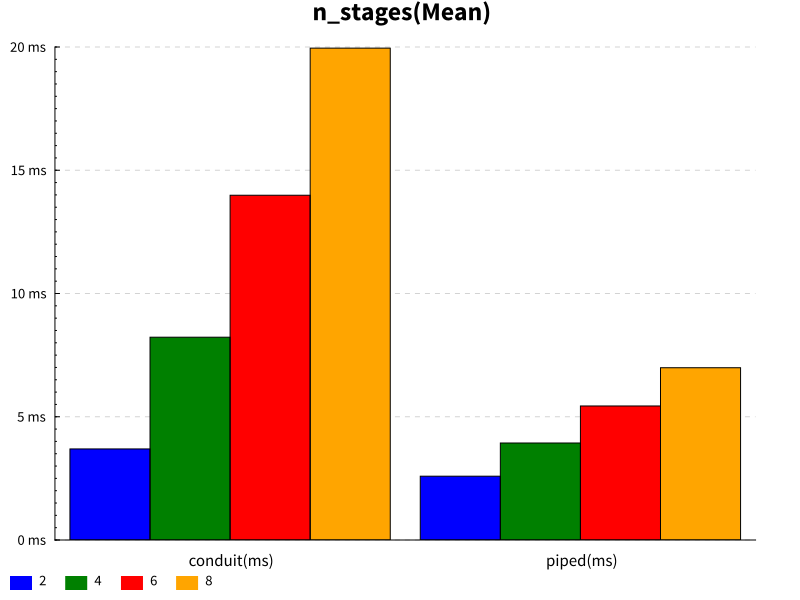
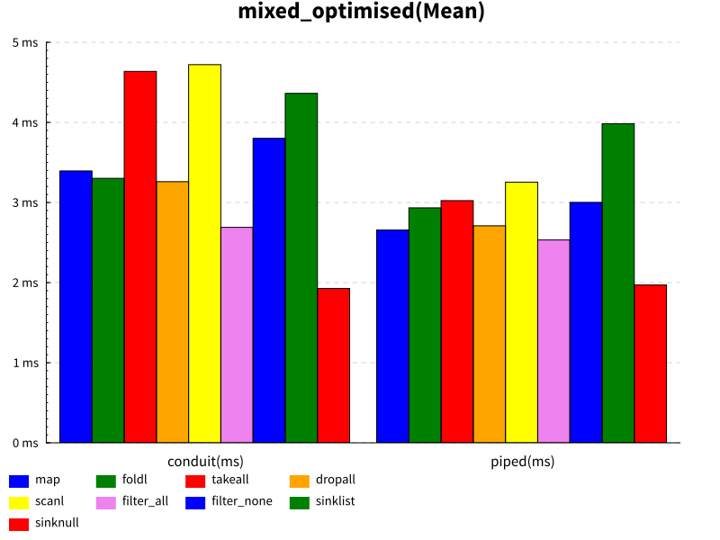

# Piped

Piped is a is a very performant coroutine based steaming library with minimal dependencies.

It was built as a learning exercise and to test the idea of a streaming library without using a sum type to represent state changes. It owes alot to Conduit; the contination passing monad, the default behaviours (demand driven, auto terminating), plus the major part of it's API.

## Features

* Depends only on `base` and `mtl`.
* Flexible composition; demand or supply driven, plus different termination modes.
* Pipes are resumable.
* Composable with existing Conduit pipes using `fromConduit` in piped-conduit.

## Quickstart

For now, familiarity with Conduit is assumed, since documentation is not extensive.

```haskell
import Piped
import qualified Piped.Prelude as P  -- for map, foldl, takeWhile and friends

runPiped $ sourceList [1,2,3] .| P.map (+1) .| sinkList
```

## Performance

There isn't a huge difference in performance for small pipelines. Maybe up to about 15% in some cases. However, once you have more stages (source-pipe-pipe-sink) or more, there is a large margin, about 50%. Of course, unless your application is shuttling millions of events per second it doens't make alot of difference, in practice.

#### How performance changes with additional stages


#### Naive implementations of common functions


#### Hand-optimised implementations of common functions (taking advantage of fusion etc)


